# Simulated Data Analysis

This article demonstrates how to fit a spatio-temporal dynamic
generalized linear model (STDGLM) to simulated data using the `STDGLM`
package. First, we load the required packages.

``` r
library(STDGLM)
```

``` r
packages <- c("dplyr", "ggplot2", "tidyr", "ggpubr", "coda", "sf")

for (package in packages) {
  if (!require(package, character.only = TRUE)) {
    install.packages(package)
    require(package, character.only = TRUE)
  }
}
#> Loading required package: dplyr
#> 
#> Attaching package: 'dplyr'
#> The following objects are masked from 'package:stats':
#> 
#>     filter, lag
#> The following objects are masked from 'package:base':
#> 
#>     intersect, setdiff, setequal, union
#> Loading required package: ggplot2
#> Loading required package: tidyr
#> Loading required package: ggpubr
#> Loading required package: coda
#> Warning in library(package, lib.loc = lib.loc, character.only = TRUE,
#> logical.return = TRUE, : there is no package called 'coda'
#> Installing package into '/home/runner/work/_temp/Library'
#> (as 'lib' is unspecified)
#> Loading required package: coda
#> Loading required package: sf
#> Linking to GEOS 3.12.1, GDAL 3.8.4, PROJ 9.4.0; sf_use_s2() is TRUE
```

## Data Generation

The following chunk generates some covariates. We randomly sample p=30
spatial locations within the unit square. At these locations, we
generate J=3 covariates (`X`) whose effects vary in spacetime, the first
one being an intercept, and q=1 covariate (`z`) whose effect is held
constant.

``` r
p = 30
set.seed(123)
coords = data.frame(x = runif(p), y = runif(p))
D = as.matrix(dist(coords))
t = 100
J = 3
X = array(1, dim = c(p, t, J))
for (j in 2:J) {
  for (t_ in 1:t) {
    set.seed(j*t_)
    X[, t_, j] = rnorm(p)
  }
}
q=1
set.seed(10)
z = array(rnorm(p*t*q), dim = c(p, t, q))
```

Then we simulate some varying coefficients and plot them.

``` r
beta0 <- outer(
  seq(0.7, 1.5, length.out = p),
  -10*(seq(0,1,length.out = t)-0.5) - 50*(seq(0,1,length.out = t)-0.5)^2 + 10
)

tempo <- (1:t)
beta1 <- outer(
  - .6* (coords$x-.9)^2 + .6* (coords$y-.5)^2,
  sin(tempo/t*2*pi) + 3, FUN = "+"
)

beta2 = 4*outer(
  - .6* (coords$x-.9)^2 + 1* (coords$y-.5)^2,
  0.5*sin(tempo/t*2*pi) + 0.5*cos(tempo/t*4*pi), 
  FUN = "+"
)
```

``` r
matplot(t(beta0), type = 'l', main = 'Beta 0', xlab = 'Time')
```


``` r
matplot(t(beta1), type = 'l', main = 'Beta 1', xlab = 'Time')
```


``` r
matplot(t(beta2), type = 'l', main = 'Beta 2', xlab = 'Time')
```

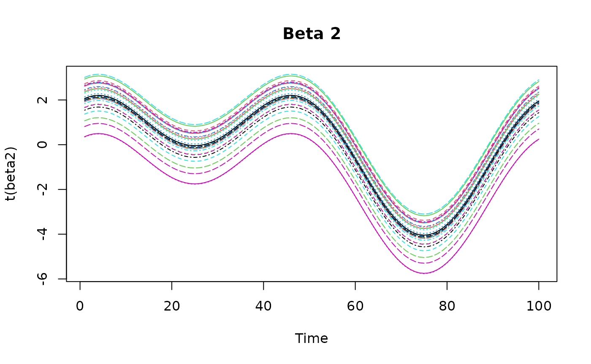

Next, we simulate the response variable `Y` using the observation
equation. The observation error is assumed to be normally distributed
with mean zero and variance \sigma\_\epsilon^2 = 2.

``` r
gamma <- 1
set.seed(42)
eps = matrix(rnorm(p*t, sd = sqrt(2)), nrow = p, ncol = t)
Y <- beta0 + beta1*X[,,2] + beta2*X[,,3] + gamma*z[,,1] + eps
```

``` r
matplot(t(Y), type = 'l', main = 'Y', xlab = 'Time')
```


## Model Fitting

Before fitting the model, we need to prepare a list of prior
hyperparameters. Here, we assume vague priors for all the parameters.
These are also the default values used when `prior=NULL`.

``` r
prior_list = list(
  V_beta_0 = 1e4,         # Prior variance of initial state
  V_gamma = 1e6,          # Prior variance of constant coefficients
  a_inn_time = 0.01,      # Prior shape for temporal variance
  b_inn_time = 0.01,      # Prior rate for temporal variance
  a_rho1s = 0.01,         # Prior shape for spatial variance
  b_rho1s = 0.01,         # Prior rate for spatial variance
  a_rho1st = 0.01,        # Prior shape for spatio-temporal variance
  b_rho1st = 0.01,        # Prior rate for spatio-temporal variance
  s2_a = 0.01,            # Prior shape for measurement error variance
  s2_b = 0.01             # Prior rate for measurement error variance
)
```

The MCMC setup is provided in the next chunk. You can adjust the number
of iterations, burn-in period, thinning interval, and other parameters
as needed. The `point.referenced` argument indicates that the data are
point-referenced, and `random.walk` specifies that we want to use a
random walk structure for time-varying parameters.

``` r
nburn <- 200                # burn-in period
nrep <- 200                 # number of iterations to save after burn-in
thin <- 1                   # thinning interval
point.referenced = TRUE     # data are point-referenced
random.walk = TRUE          # random walk structure for time-varying parameters
print.interval = 50         # print message during execution of MCMC
```

The following command executes the MCMC algorithm to fit the STDGLM
model to the simulated data. The `stdglm` function takes the response
variable `Y`, covariates `X` and `z`, and other parameters defined
above. The output is an object of class `stdglm`, i.e. a list containing
the MCMC samples and other posterior summaries. The output is described
[in a separate
article](https://czaccard.github.io/STDGLM/articles/model_output.html).

``` r
mod <- stdglm(y=Y, X=X, Z=z, 
              point.referenced=point.referenced, 
              random.walk=random.walk, 
              W=D,
              nrep=nrep, nburn=nburn, thin=thin, 
              print.interval=print.interval, 
              prior=prior_list
)
#> Starting MCMC (400 iterations)...
#> Iteration: 50 / 400
#> Iteration: 100 / 400
#> Iteration: 150 / 400
#> Iteration: 200 / 400
#> Iteration: 250 / 400
#> Iteration: 300 / 400
#> Iteration: 350 / 400
#> Iteration: 400 / 400
#> MCMC finished.
```

### `fitted`, `coef` and `plot` methods

The `fitted` method provides the mean of the posterior predictive
distribution for the observed data points. We can also `plot` the fitted
values against the observed data for a specific location.

``` r
fitted_values <- fitted(mod)
print(dim(fitted_values))
#> [1]  30 100
summary(t(fitted_values[1:5,]))
#>        V1                V2               V3                V4         
#>  Min.   :-8.0731   Min.   :-8.794   Min.   :-10.041   Min.   :-12.383  
#>  1st Qu.: 0.4735   1st Qu.: 1.875   1st Qu.:  2.092   1st Qu.:  0.539  
#>  Median : 4.3935   Median : 5.713   Median :  5.392   Median :  6.080  
#>  Mean   : 3.9990   Mean   : 4.886   Mean   :  4.699   Mean   :  5.044  
#>  3rd Qu.: 6.9766   3rd Qu.: 8.587   3rd Qu.:  7.949   3rd Qu.:  9.050  
#>  Max.   :16.5299   Max.   :13.997   Max.   : 14.391   Max.   : 16.155  
#>        V5         
#>  Min.   :-11.581  
#>  1st Qu.:  1.693  
#>  Median :  4.749  
#>  Mean   :  4.766  
#>  3rd Qu.:  8.407  
#>  Max.   : 19.634
```

``` r
plot(mod, Y=Y, id=1) # pick a number between 1 and p
```

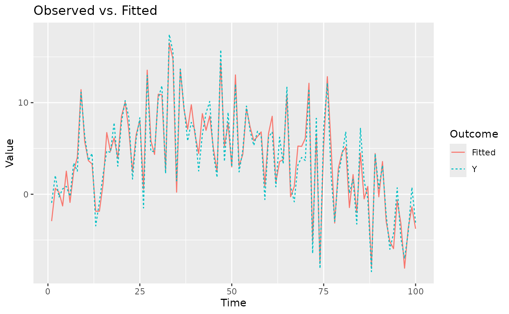

The `plot` method returns an object from the `ggplot2` package, so it is
straightforward to customize, save, and arrange multiple plots.

``` r
g1 = plot(mod, Y=Y, id=1)
# ggsave("plot1.png", plot = g1)
g2 = plot(mod, Y=Y, id=2)
# ggsave("plot2.png", plot = g2)

ggarrange(g1, g2, labels = c("#ID 1", "#ID 2"), label.x = 0.8)
```

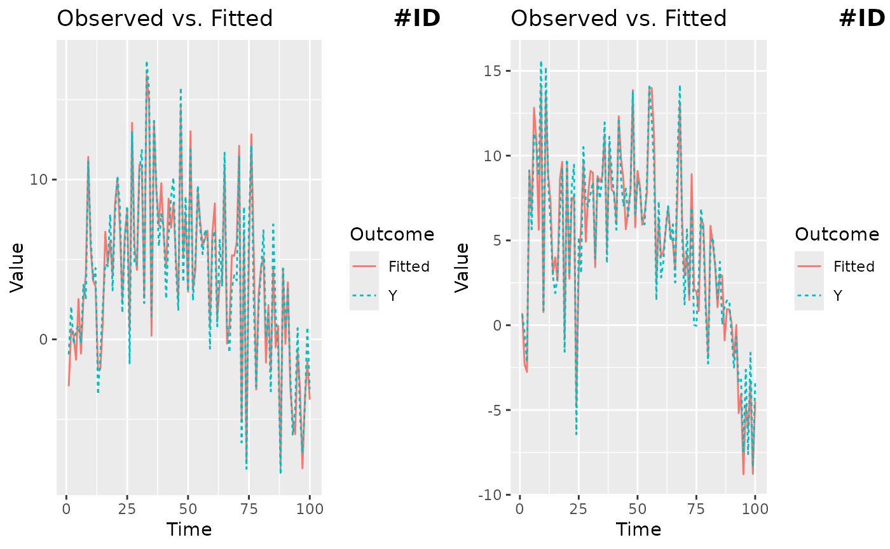

Posterior summaries for all the coefficients can be extracted using the
`coef` method. Here we show those of constant coefficients.

``` r
print(coef(mod, 'overall'))
#>         Mean         sd     ci_low     ci_high
#> 1  6.3168361 0.02767138  6.2626011  6.37107097
#> 2  2.9331528 0.02717265  2.8798954  2.98641022
#> 3 -0.1092179 0.02771084 -0.1635301 -0.05490561
print(coef(mod, 'gamma'))
#>       Mean         sd    ci_low  ci_high
#> 1 1.006071 0.02622202 0.9546773 1.057466
```

The `plot` method can also be used to visualize the time-varying,
space-varying, and spacetime-varying coefficients. The returned object
is a `ggplot` object. The label “Observed” indicates that the values
refer to the observed spatio-temporal data points. For time-varying and
spacetime-varying coefficients, the 95% credible intervals (CI) are
within the dashed lines, whereas for the space-varying coefficients the
posterior standard deviation is shown for each location.

``` r
plot(mod, 'tvc')
#> [[1]]
```

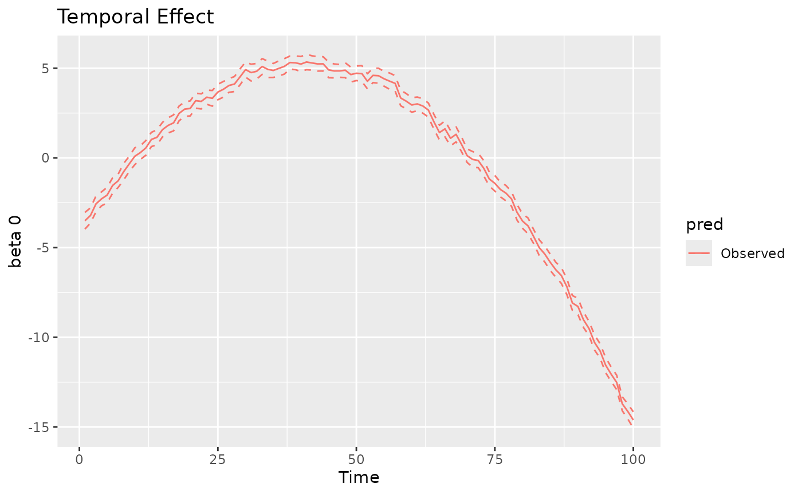

    #> 
    #> [[2]]

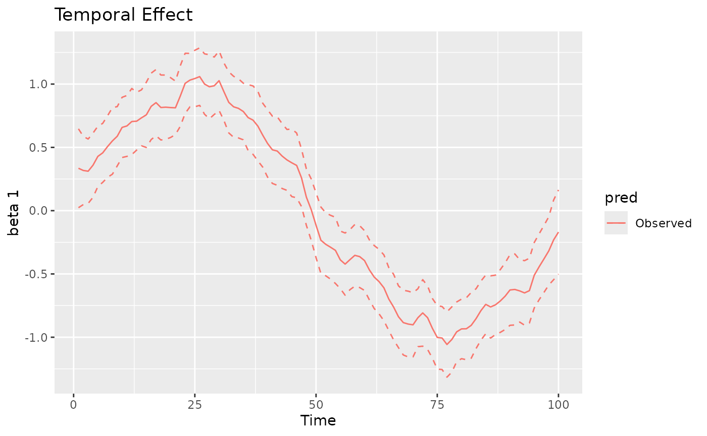

    #> 
    #> [[3]]

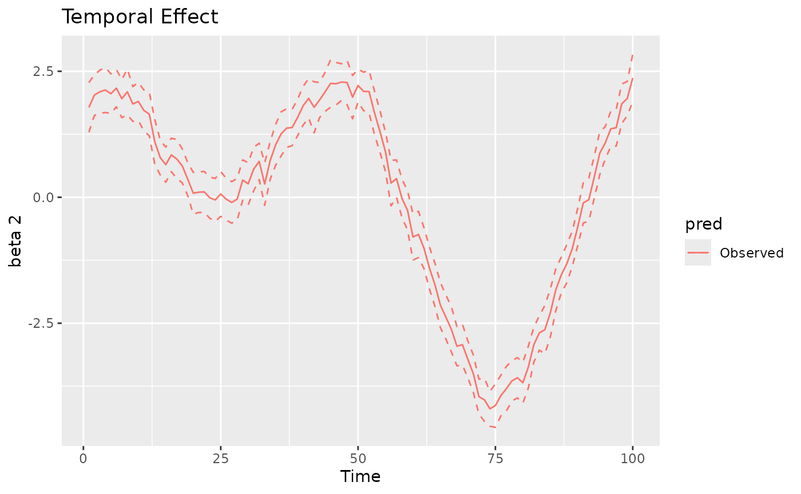

``` r
coords_sf = st_as_sf(coords, coords = c("x", "y"))
unit_square_coords <- matrix(
  c(
    0, 0,
    1, 0,
    1, 1,
    0, 1,
    0, 0
  ),
  ncol = 2,
  byrow = TRUE
)
region = st_sf(
  geometry = st_sfc(st_polygon(list(unit_square_coords)))
)
plot(mod, 'svc', coords_sf, region)
#> [[1]]
```


    #> 
    #> [[2]]


    #> 
    #> [[3]]

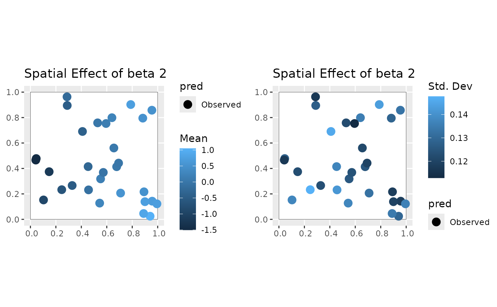

``` r
plot(mod, 'stvc', ids=c(1:9))
#> [[1]]
```

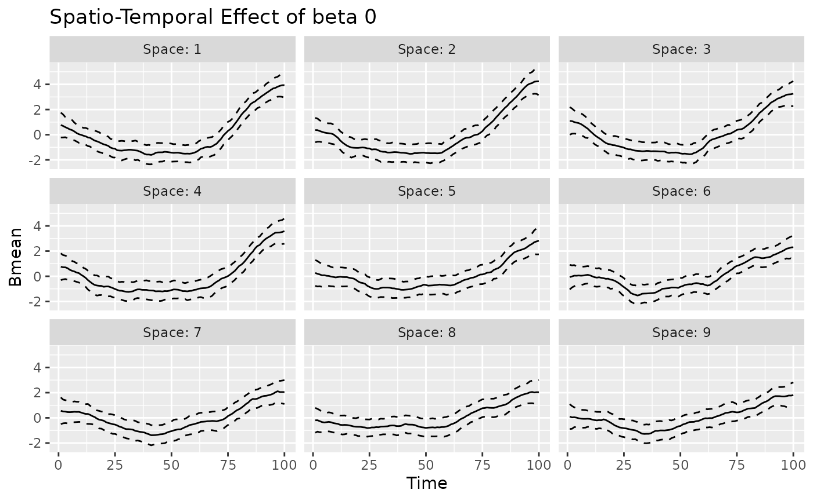

    #> 
    #> [[2]]

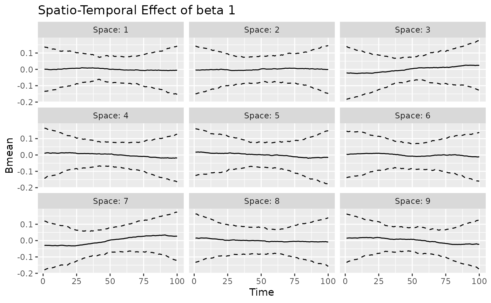

    #> 
    #> [[3]]


The `coef` method can be used also for the varying coefficients. For
example, we can compare the posterior mean of the spacetime-varying
effect of `beta0` with its true value.

``` r
st_effect_b0 = beta0 + mean(beta0) - 
  matrix(rowMeans(beta0), nrow = nrow(beta0), ncol = ncol(beta0)) - 
  matrix(colMeans(beta0), nrow = nrow(beta0), ncol = ncol(beta0), byrow = TRUE)

beta0_post = coef(mod, 'stvc') %>%
  filter(Coef == 'beta0') %>% 
  mutate(Truth = as.vector(st_effect_b0)) %>%
  filter(Space %in% 1:9) %>% 
  select(Space:Mean, Truth) %>% 
  pivot_longer(cols = c('Mean', 'Truth'), names_to = 'Type', values_to = 'Value')
ggplot(beta0_post, aes(x = Time, y = Value, color = Type)) +
  geom_line() +
  facet_wrap(~ Space, nrow = 3) +
  labs(title = "Posterior Mean vs Truth for beta0")
```

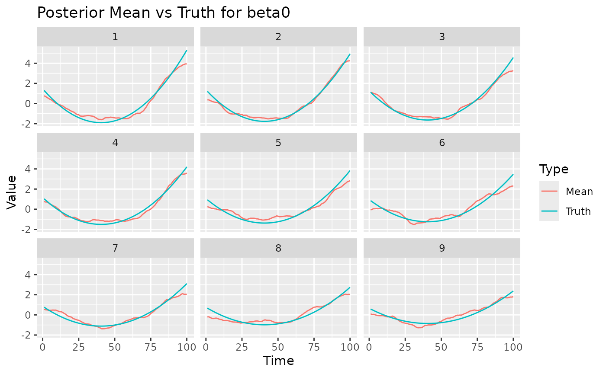

### Trace plots

We can also visualize the trace plots of the MCMC samples for the
parameters of interest. For that purpose, we can convert the output to
an `mcmc` object, then use the `plot` function from the `coda` package.

``` r
plot(mcmc(t(mod$out$sigma2))) # measurement error variance
```


``` r
plot(mcmc(t(mod$out$sigma2_Btime))) # evolution variances of temporal effects for j=1,...,J
```

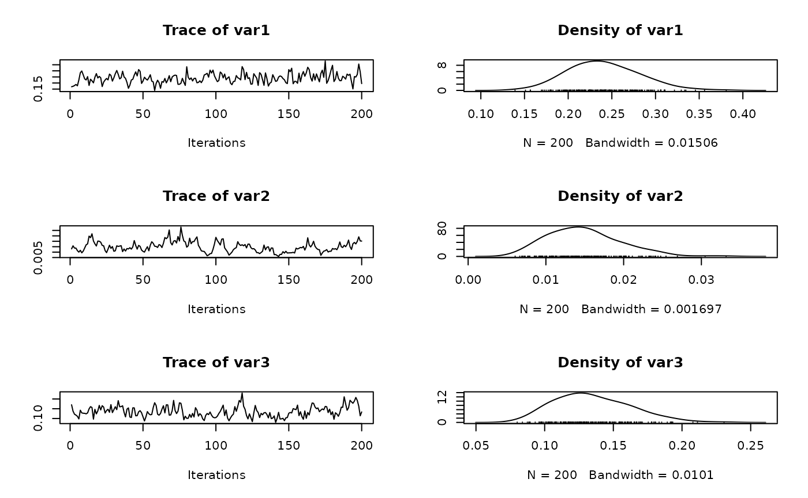

``` r
plot(mcmc(t(mod$out$rho1_space))) # partial sill of spatial effects for j=1,...,J
```

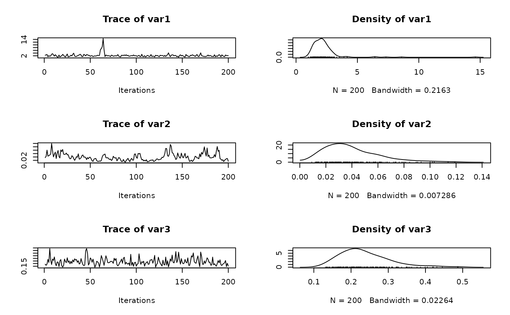

``` r
plot(mcmc(t(mod$out$rho2_space))) # range of spatial effects for j=1,...,J
```


``` r
plot(mcmc(t(mod$out$rho1_spacetime))) # partial sill of spatio-temporal effects for j=1,...,J
```


``` r
plot(mcmc(t(mod$out$rho2_spacetime))) # range of spatio-temporal effects for j=1,...,J
```

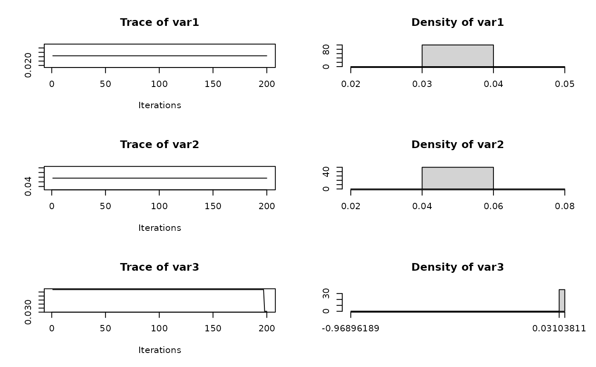

``` r
if (!random.walk) {
  plot(mcmc(t(mod$out$phi_AR1_time))) # AR(1) coefficient for temporal evolution for j=1,...,J
  plot(mcmc(t(mod$out$phi_AR1_spacetime))) # AR(1) coefficient for spatio-temporal evolution for j=1,...,J
}
plot(mcmc(t(mod$out$gamma))) #  coefficient of the z covariate
```


### Restoring previous state

The MCMC algorithm has not converged yet, however it is very easy to
continue previous chain. You just need to provide `mod` as an argument
to the `stdglm` function. The MCMC will continue from the last saved
state. *Note that all previous samples will be discarded*.

``` r
mod <- stdglm(y=Y, X=X, Z=z, 
              point.referenced=point.referenced, 
              random.walk=random.walk, 
              W=D,
              nrep=nrep, nburn=nburn, thin=thin, 
              print.interval=print.interval, 
              prior=prior_list,
              last_run = mod
)
```

### Model Selection and Comparison

The `stdglm` object also contains tools for model selection and
comparison, including the Deviance Information Criterion (DIC), the
Widely Applicable Information Criterion (WAIC), scoring rules and
Bayesian *p-values*. These are all described [in a separate
article](https://czaccard.github.io/STDGLM/articles/model_output.html).

``` r
print(mod$ave$DIC)
#> [1] 10942.04
print(mod$ave$WAIC)
#> [1] 10964.29
```

## Temporal predictions and Spatial interpolation

In this section, we will demonstrate how to perform out-of-sample
predictions. We will create a grid of new spatial locations and generate
new covariates for these locations. We also assume that we want to
predict the next 10 time points, so we set `h_ahead = 10`. The new
covariates are generated in a similar way as before, but now we have
`p_new` locations and `t_new = t + h_ahead` time points.

``` r
st_new = st_make_grid(region, what = "centers", n = c(20, 20))
p_new = NROW(st_new)
h_ahead = 10
t_new = t + h_ahead

coords_pred = as.data.frame(st_coordinates(st_new))
names(coords_pred) = names(coords)

Xpred = array(1, dim = c(p_new, t_new, J))
for (j in 2:J) {
  for (t_ in 1:t_new) {
    set.seed(j*t_*2)
    Xpred[, t_, j] = rnorm(p_new)
  }
}

q=1
set.seed(10*8)
zpred = array(rnorm(p_new * t_new * q), dim = c(p_new, t_new, q))
```

The function `stdglm` performs spatial interpolation using a blocked
structure. This is useful when the number of new spatial locations is
very large. Therefore, three lists are created to store the indices of
new locations (`blocks_indices`), the distance matrices for the
prediction locations (`D_pred`), and the cross-distance matrices
(`D_cross`). In the following code chunk, each block is made up of just
one location.

``` r
ii = floor(seq(1, p_new+1, by = 1))
lii = length(ii)

D_pred = D_cross = blocks_indices = vector('list', lii-1)
for (i in 2:lii) {
  Dalltemp = as.matrix(dist(rbind(coords, coords_pred[ii[i-1]:(ii[i]-1), ])))
  D_pred[[i-1]] = unname(Dalltemp[-(1:p), -(1:p), drop=FALSE])
  D_cross[[i-1]] = unname(Dalltemp[1:p, -(1:p), drop=FALSE])
  blocks_indices[[i-1]] = ii[i-1]:(ii[i]-1)
}
```

The following command fits the STDGLM model, continuing the previous
run. There is also the possibility to set the number of cores for
parallel processing using the `ncores` argument: if its value is greater
than 1, the spatial predictions will be performed in parallel during
each MCMC iteration.

``` r
mod <- stdglm(y=Y, X=X, Z=z, 
              point.referenced=point.referenced, 
              random.walk=random.walk, 
              blocks_indices=blocks_indices,
              W=D, W_pred=D_pred, W_cross=D_cross,
              X_pred=Xpred, Z_pred=zpred,
              ncores = 1, # Set number of cores for parallel processing
              nrep=nrep, nburn=nburn, thin=thin, 
              print.interval=print.interval, 
              prior=prior_list,
              last_run = mod
)
#> Restarting MCMC from previous state...
#> Starting MCMC (400 iterations)...
#> Iteration: 50 / 400
#> Iteration: 100 / 400
#> Iteration: 150 / 400
#> Iteration: 200 / 400
#> Iteration: 250 / 400
#> Iteration: 300 / 400
#> Iteration: 350 / 400
#> Iteration: 400 / 400
#> MCMC finished.
```

The `plot` method can be used again to visualize the posterior
predictive summaries (posterior mean and 95% CIs) of the varying
coefficients. The observed spatio-temporal points are clearly
distinguished from the predicted ones.

``` r
plot(mod, 'tvc')
#> [[1]]
```

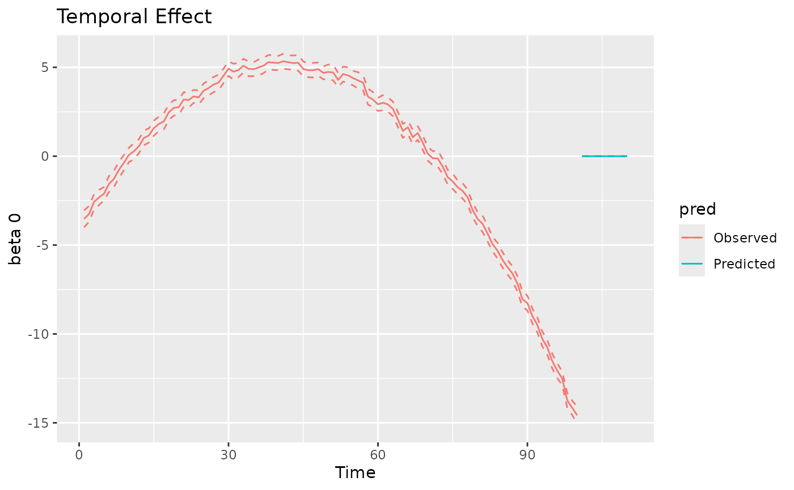

    #> 
    #> [[2]]

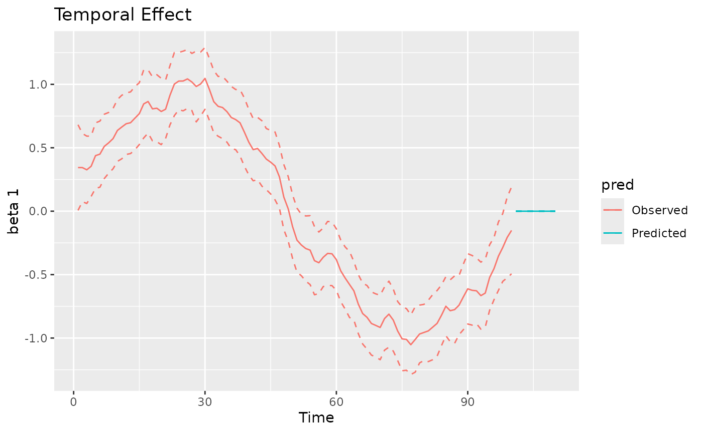

    #> 
    #> [[3]]

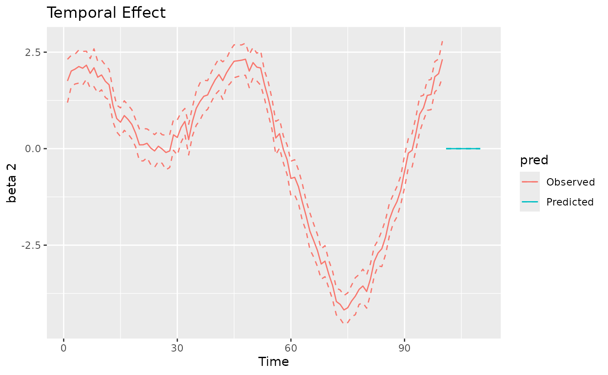

``` r
coords_pred_sf = st_as_sf(coords_pred, coords = c("x", "y"))
plot(mod, 'svc', coords_sf, region, coords_pred_sf)
#> [[1]]
```

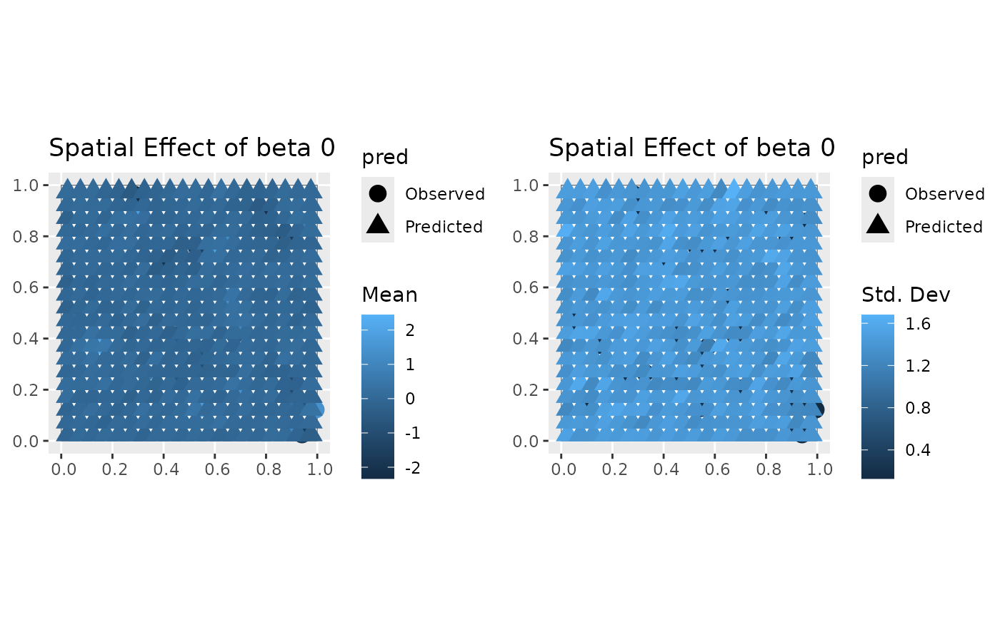

    #> 
    #> [[2]]

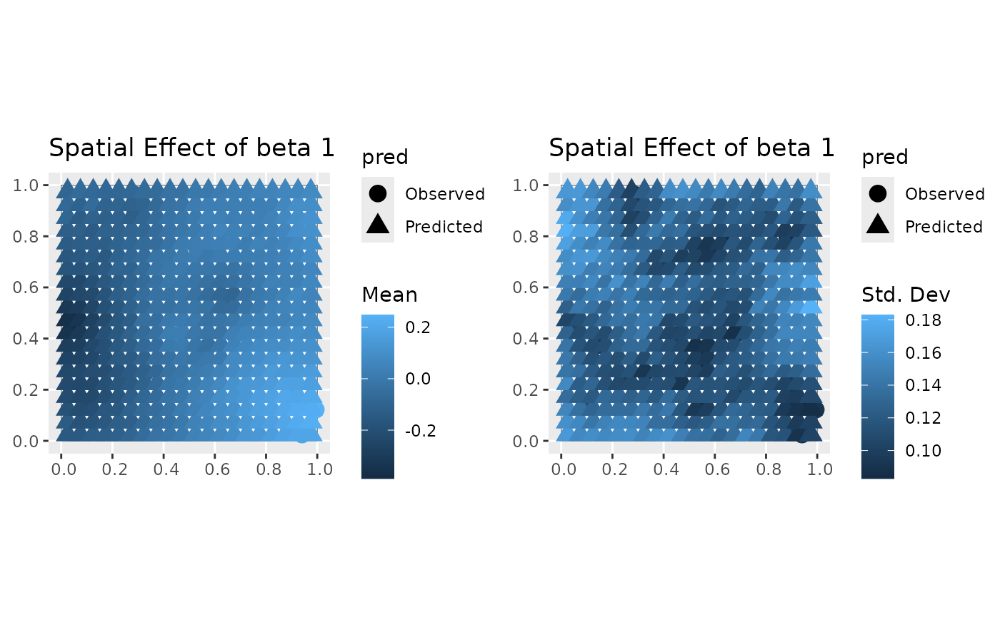

    #> 
    #> [[3]]


``` r
plot(mod, 'stvc', ids=c(1:9), pred = TRUE) # first 9 new locations
#> [[1]]
```

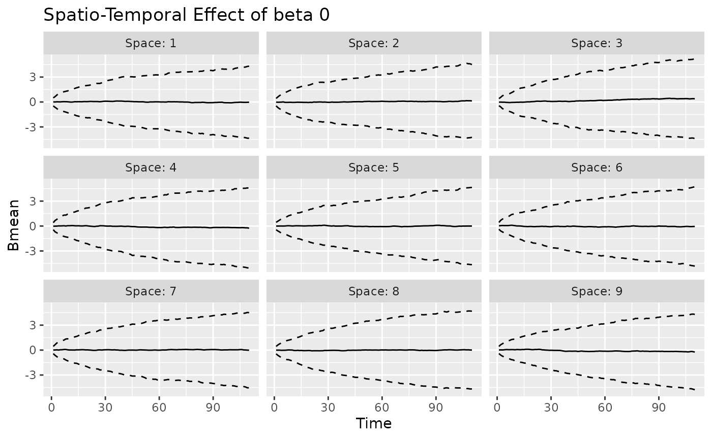

    #> 
    #> [[2]]


    #> 
    #> [[3]]


The `predict` method can be used to easily access the posterior
predictive summaries, for both the response variable, as shown below,
and the varying coefficients. The input `Coo_sf_pred` (optional) allows
to return a simple feature object, which may be useful for plotting.

``` r
Y_pred = predict(mod, type = 'response_df', Coo_sf_pred = coords_pred_sf)
ggplot(Y_pred %>% filter(Time==10)) +
    geom_sf(data = region, fill = "white") +
    geom_sf(aes(color = Mean)) +
    labs(title = "Predicted outcome at time 10")
```

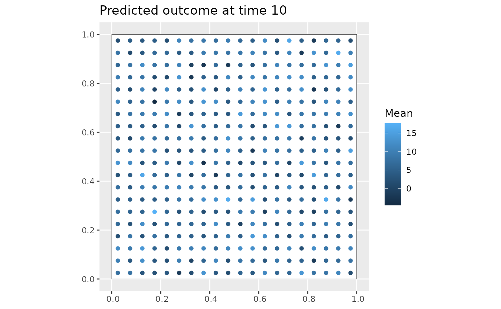
